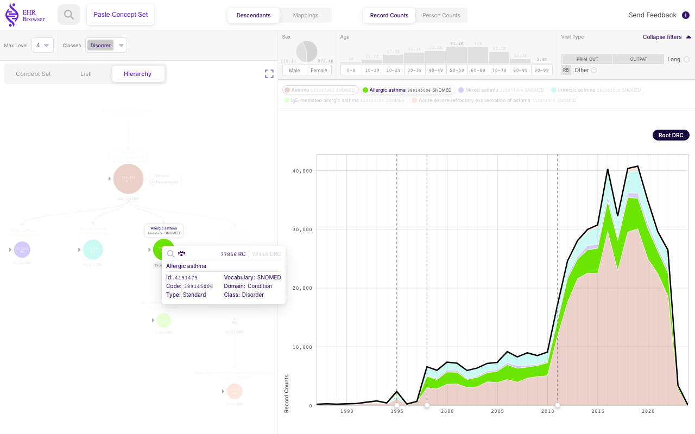
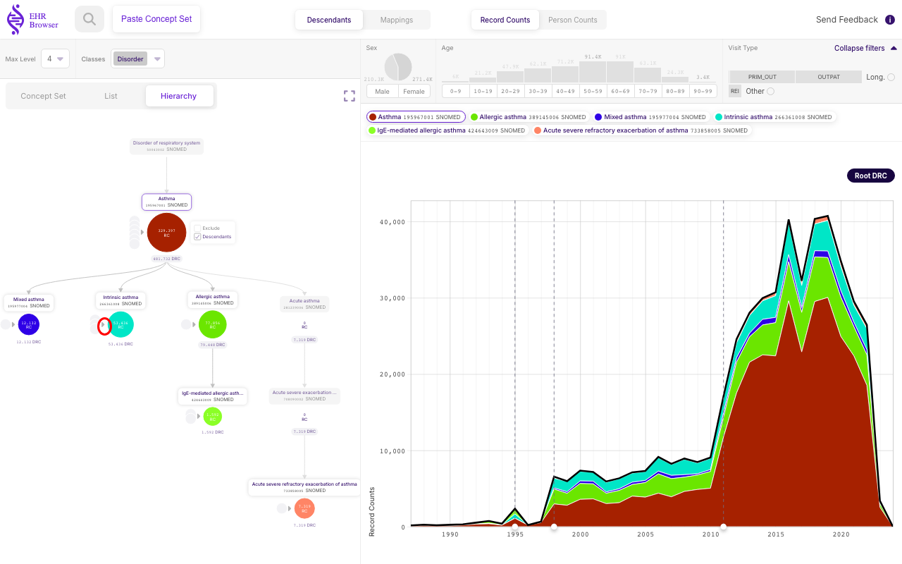
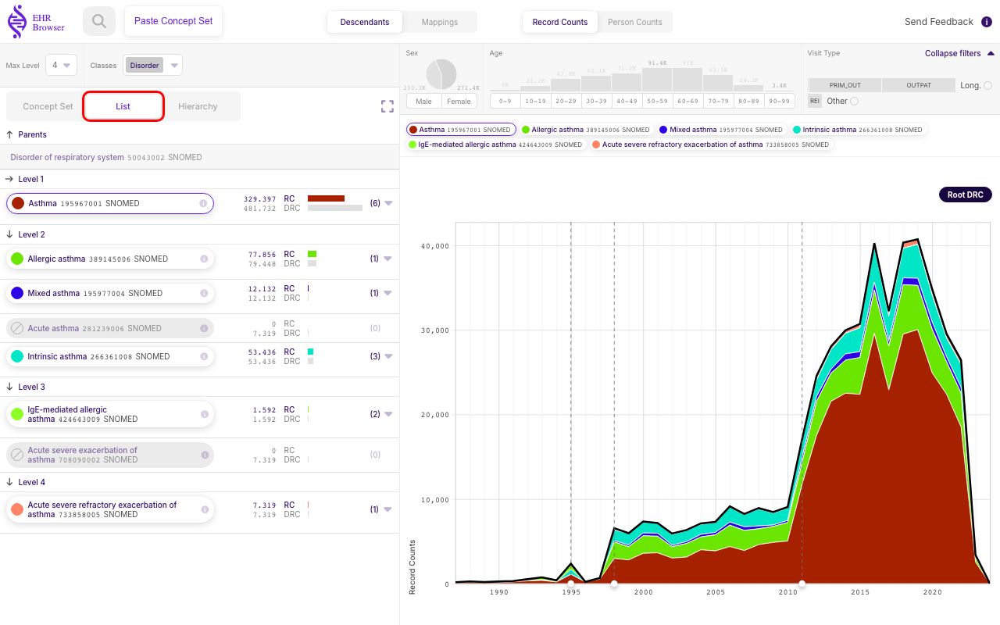
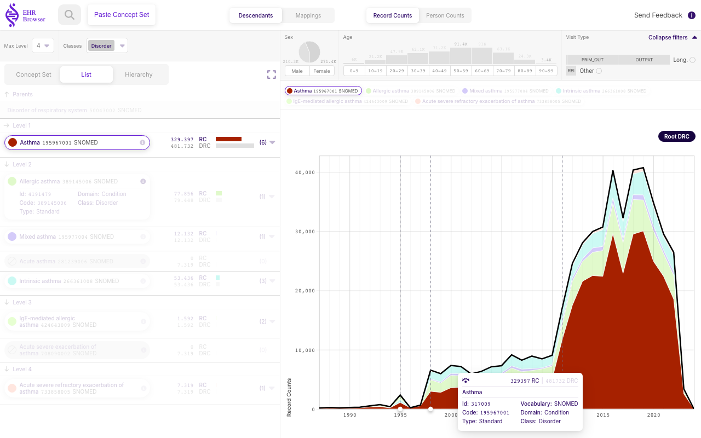
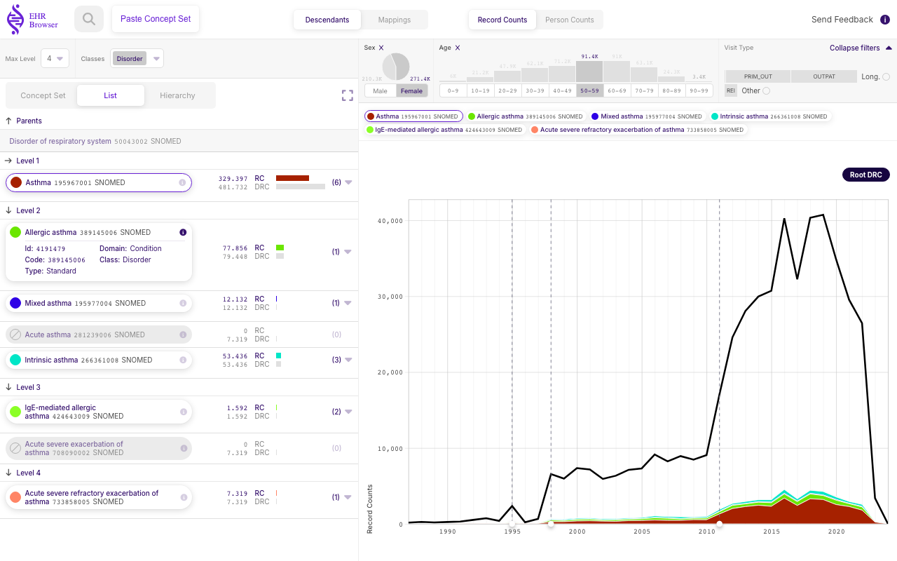
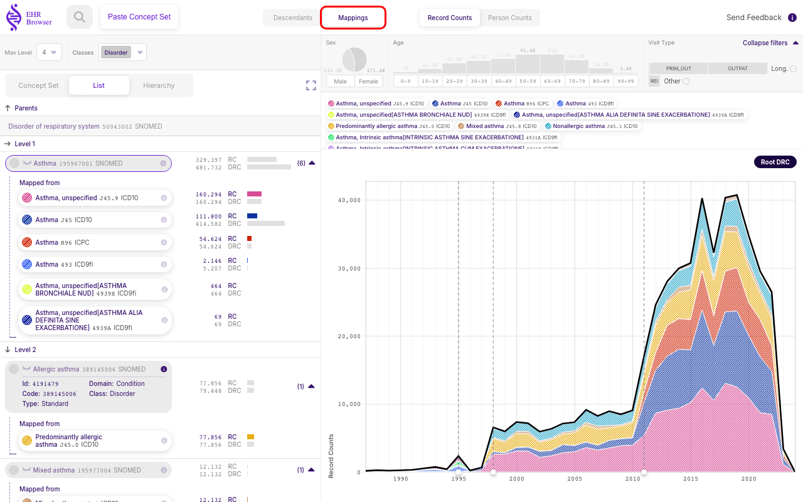
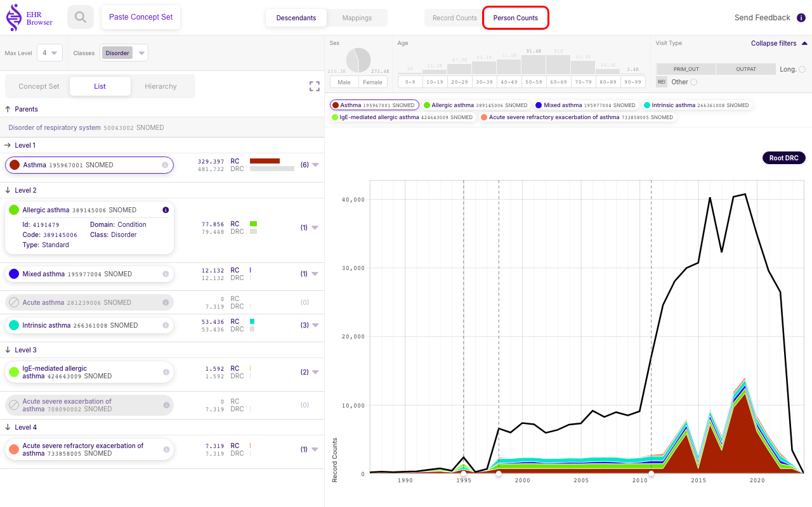

# Exploring a single Standard Concept

**EHRBrowser** lets you load any **Standard** **Concept** from the **OMOP-CDM** vocabulary and explore its descendant hierarchy, how the counts break down by sex, age and visit type, and how they evolve over time. This chapter walks through loading **Asthma** (**SNOMED**) as a worked example, from the initial search all the way to switching the whole view between record and person counts.

## Searching for a concept

Every session starts from the **Search concept** field. Typing `Asthma` returns each matching code across the vocabularies — the **SNOMED**, **ICD**, **ICPC** and other versions of Asthma appear side by side, each labelled with its vocabulary. Hovering a result previews it; selecting the **Asthma** **SNOMED** entry (highlighted above) loads it as the current **Concept** and opens its page.

## Overall view

Once a **Concept** is loaded the page is split into three areas:

- **Concept Control (top bar)** — changes the current **Concept** or switches settings that affect the whole page, such as showing mapped concepts or switching between record and person counts.
- **Hierarchy view (left panel)** — shows how the counts are distributed across the **Concept** hierarchy, through three interchangeable views.
- **Counts stratified view (right panel)** — shows how the counts are distributed across sex, age, visit type and time.

The three sections below describe each area in turn.

### Hierarchy panel (left panel)

The left panel offers three ways to look at the same **Concept** and its descendants, chosen with the selector at the top: **Concept Set**, **Hierarchy** and **List**.

#### Concept Set

**EHRBrowser** is built around displaying **Concept Sets**, so even when you are working with a single **Concept** it is shown as a **Concept Set** containing that one **Concept** together with all of its descendants. The **Concept Set** view lists the selected **Concept** and its **DRC** (Descendant Record Counts) — the number of records for the **Concept** and everything beneath it in the hierarchy.

#### Hierarchy tree

The **Hierarchy** view draws the vocabulary as a tree. The selected **Concept** sits on the second level; the levels above it are its parents and the levels below are its descendants. Each node shows its **RC** (Record Counts) — drawn as a circle whose size is proportional to the count — with the **DRC** (Descendant Record Counts) beneath it. **RC** is the number of times the **Concept** itself appears in the database; **DRC** is the number of times the **Concept** and all of its descendants appear.

Hovering over a node — here **Allergic asthma** — drops down an information card and highlights that **Concept** in the time plot on the right. Clicking the magnifying glass in the card reselects that **Concept** as the main one, so the tree doubles as a way to navigate the vocabulary.

A **Standard** **Concept** typically carries small grey circles on the **left** of its node — highlighted above on **Intrinsic asthma**.

Clicking those grey circles reveals the non-standard codes that map **to** that **Standard** **Concept**. Clicking the small cross closes them again.

#### List

The tree can grow large and its nodes hard to read, so the **List** view compacts the same descendants into a flat list grouped by tree level, each row showing its **RC** (Record Counts) and **DRC** (Descendant Record Counts).

As in the tree, clicking the information (i) icon on a row — here **Allergic asthma** — drops down that **Concept's** details.

And, like the grey circles in the tree, the arrow on the left of a row expands the non-standard codes mapped to that **Concept**, shown under **Mapped from** — here for **Intrinsic asthma**.

### Counts panel (right panel)

The right panel visualises the counts over time. The main chart is a stacked area plot of the **RC** (Record Counts) for the selected **Concept** and all of its descendants across the years, with a legend naming each coloured **Concept**. The black line along the top traces the **DRC** (Descendant Record Counts) of the selected **Concept**.

Hovering over an area highlights that **Concept** and drops down more information about it — here the large bottom layer, the root **Asthma** **Concept**.

Above the plot sit the **Sex**, **Age** and **Visit Type** panels. Each shows how the record counts are distributed across that dimension, and each also acts as a filter when clicked.

Selecting **Female** and the **50–59** age band restricts the time plot to the record counts occurring in women aged 50 to 59.

### Concept Control (top bar)

The top bar controls the whole view below it. It holds the application icon, the search field, the **Descendants** / **Mappings** switch, the **Record Counts** / **Person Counts** switch and the feedback button. Searching for another **Concept** here updates the entire view to that new **Concept**.

Earlier we opened the mapped codes for a single **Concept**. Clicking **Mappings** in the top bar instead opens the mapped codes for every **Concept** in the tree and list at once.

Switching back to **Descendants** and then to **Person Counts** displays **PC** (Person Counts) and **DPC** (Descendant Person Counts) instead of **RC** and **DRC**. This rescales the time plot to person counts and relabels the **Hierarchy** tree nodes; the **List** counts and the **Sex** / **Age** / **Visit Type** filters remain record-based.
