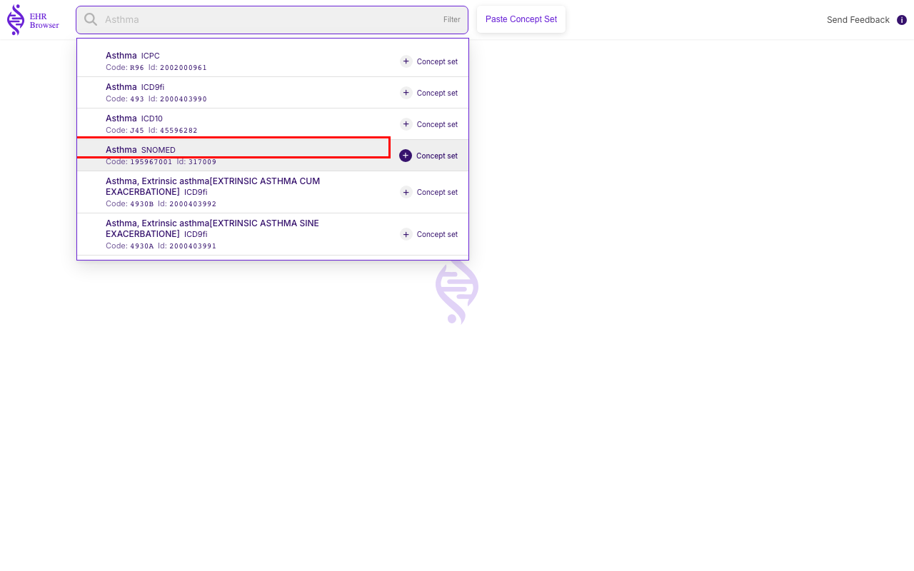
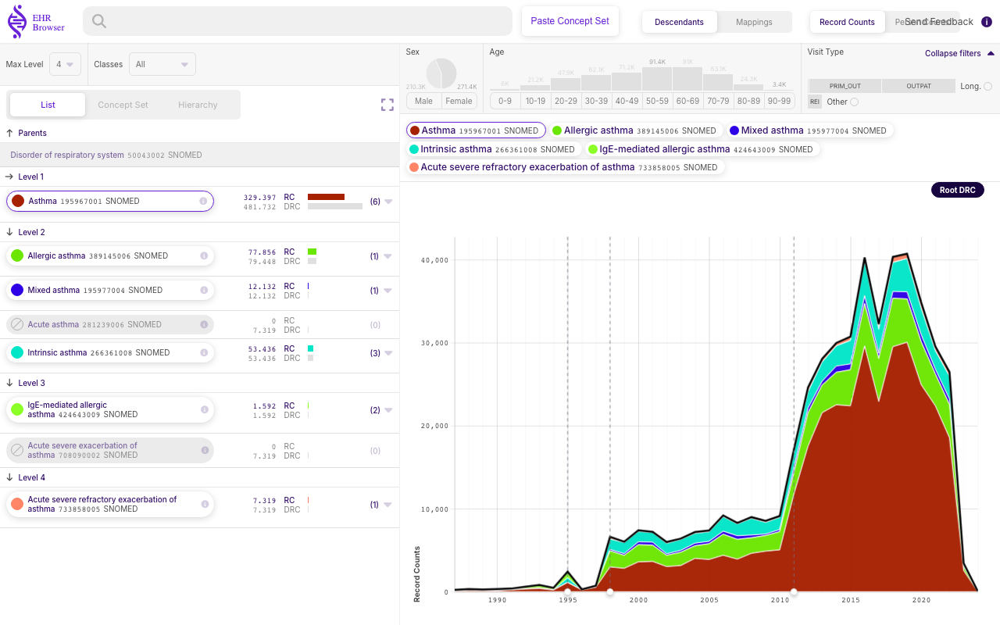
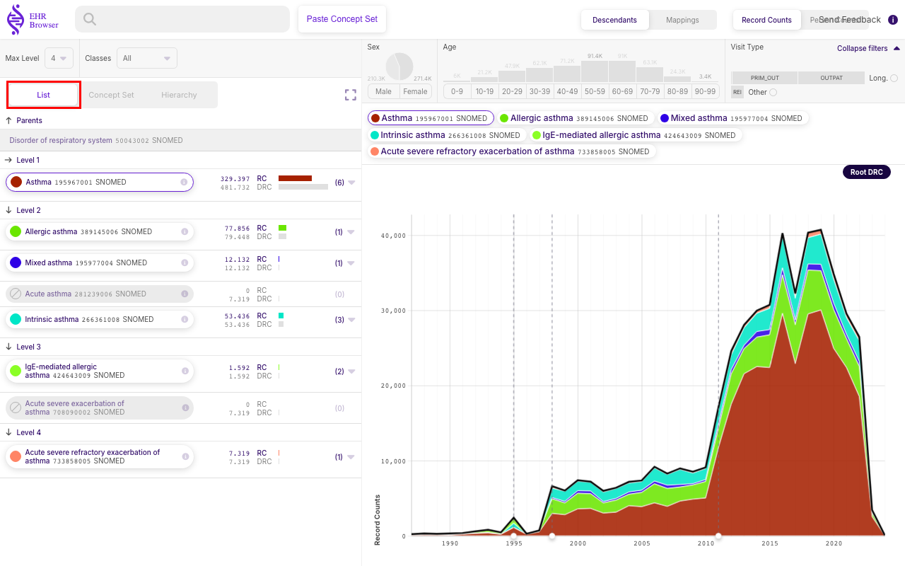
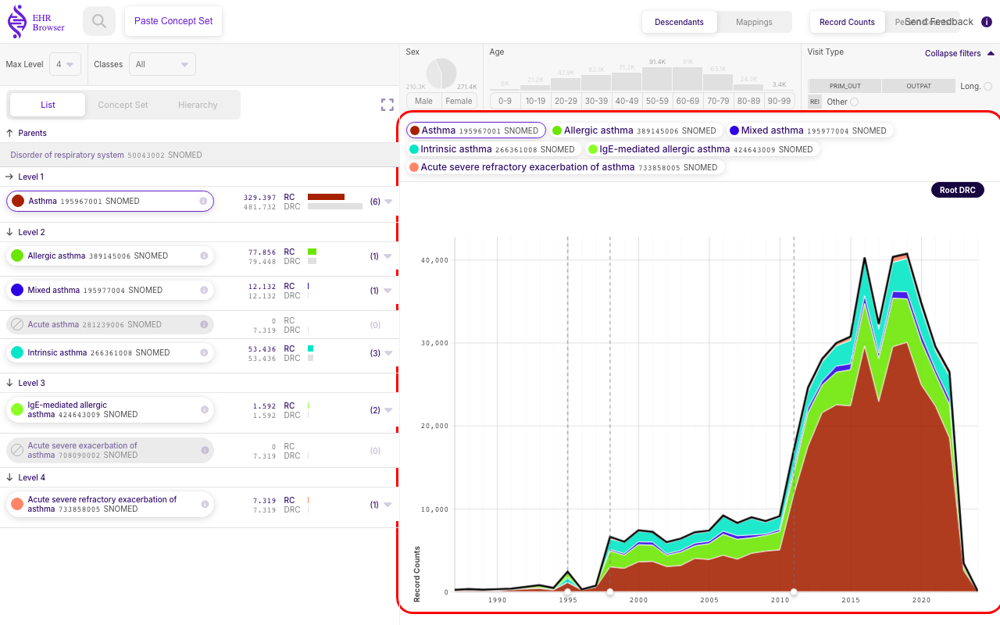

# Exploring a single Standard Concept

The EHR Browser lets you load any standard concept from the vocabulary and immediately see its descendants, their record counts over time, and how the counts break down by sex and age. This section walks through loading **Asthma (SNOMED)** as an example.

## Searching for a concept

Type into the **Search concept** field at the top of the page to look up a concept by name. As you type "Asthma", the browser shows a live list of matching concepts, each with its vocabulary, code, and id. The highlighted row below is **Asthma — SNOMED** (`Code: 195967001`, `Id: 317009`), the standard concept we want to explore. Each result also offers a **Concept set** shortcut on the right.

Clicking **Asthma SNOMED** loads that concept's page.

## The concept view

The concept page is organized into three areas:

- **Top bar** — controls that affect the whole page. **Descendants / Mappings** switches between showing the concept's descendant hierarchy and its non-standard mappings, and **Record Counts / Person Counts** switches which count is displayed throughout the page.
- **Left area** — the counts distribution across the vocabulary hierarchy. Each descendant is listed under its level with its Record Count (RC) and Descendant Record Count (DRC).
- **Right area** — the counts distribution across **Sex**, **Age**, **Visit Type**, and **Time**.

### Hierarchy view

The left area offers three ways to view the hierarchy, selected with the toggle highlighted below:

- **List** — a flat, level-by-level list of the descendant concepts.
- **Concept Set** — the concepts framed as an editable concept set.
- **Hierarchy** — the graph/tree structure of the descendants.

### Time view

The right area's time plot shows how the record counts accumulate over the years. The legend above the chart lists the colored concepts included in the plot, and each colored band in the stacked area chart corresponds to one of those concepts, so you can read both the total trend and each descendant's contribution over time.

