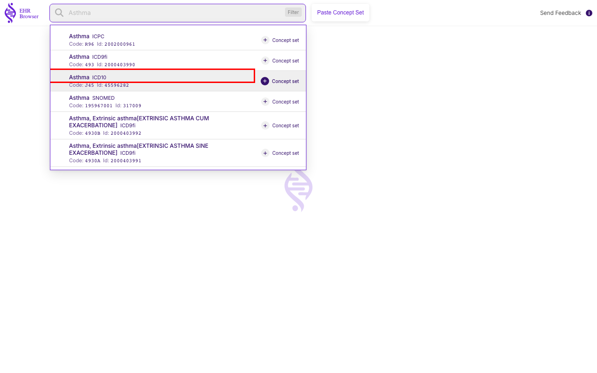
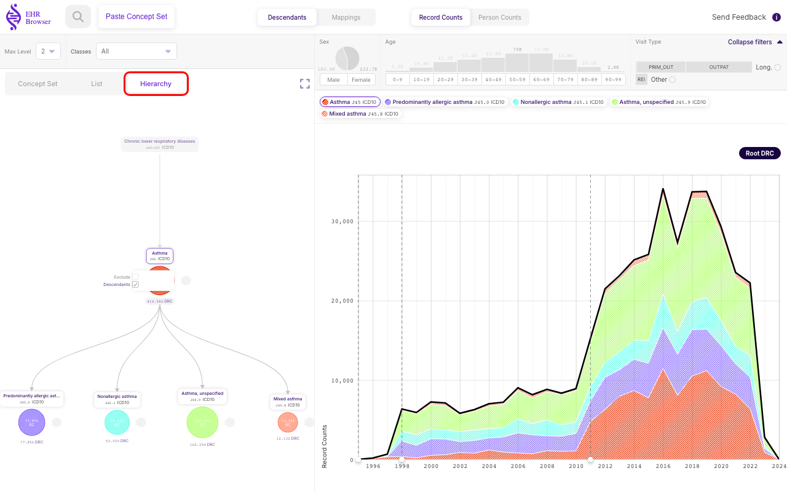
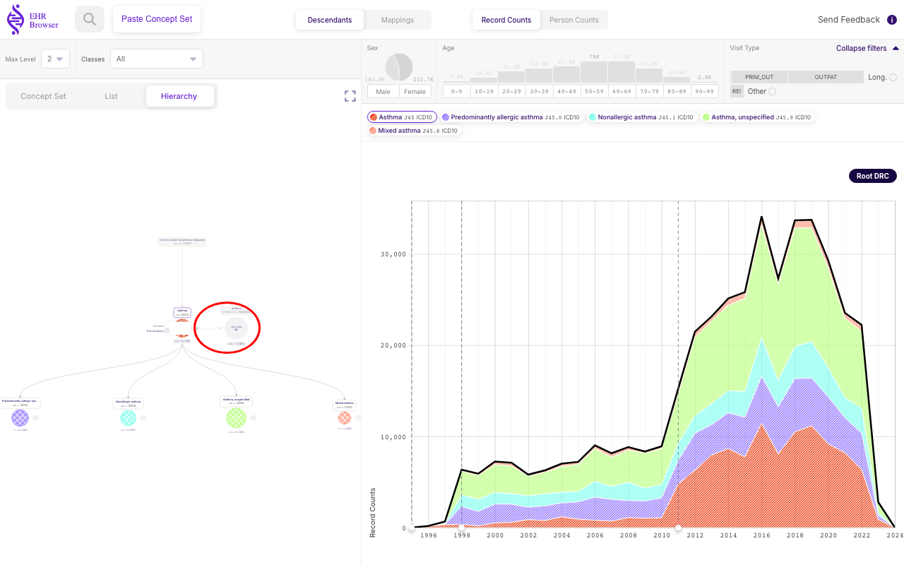
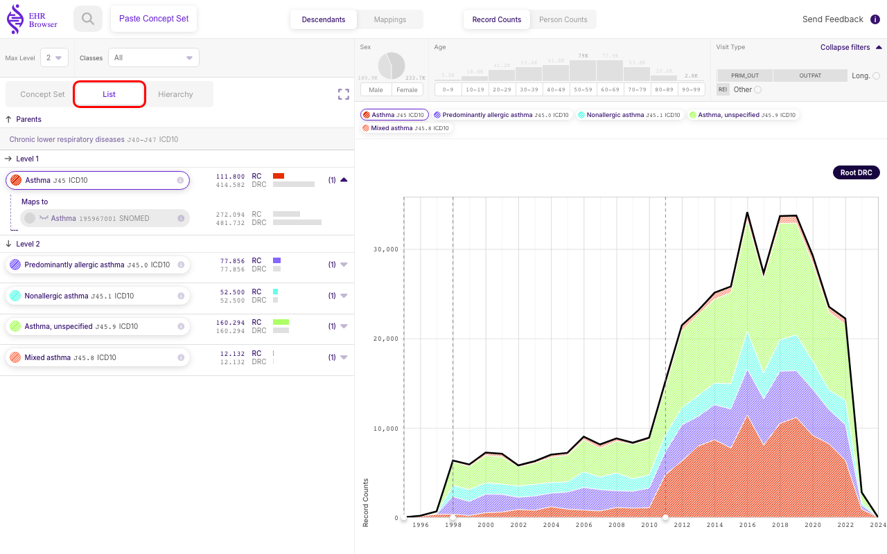

# Exploring a single non-Standard Concept

**EHRBrowser** is not limited to standard vocabulary — it can also load and explore **non-standard** concepts. In **OMOP-CDM** terminology a non-standard **Concept** is a medical code that is typically used in a national or local setup, but when an international study is conducted the equivalent **Standard** **Concept** is used instead. Being able to explore non-standard concepts directly is useful for spotting mapping errors, or for understanding the **Concept** hierarchy while working within a local study.

This chapter walks through loading the **ICD10** code **Asthma** (J45) as an example. Most of the interface behaves exactly as it does for a standard **Concept**, so this page focuses on the two places where a non-standard **Concept** looks different — the **Hierarchy** tree and the **List** — and refers back to [Exploring a single Standard **Concept**](../1.Exploring_a_single_standard_concept/README.md) for everything else.

## Searching for a concept

Just like a standard **Concept**, a non-standard **Concept** is found through the **Search concept** field. Typing `Asthma` returns every matching code across the vocabularies — here the results include the **SNOMED**, **ICPC**, **ICD9fi** and **ICD10** versions of Asthma side by side. Selecting the **ICD10** entry (code **J45**, highlighted above) opens its **Concept** page.

From this point the page layout is identical to the one described for a standard **Concept**: a **Concept Control** bar across the top, a **Hierarchy** panel on the left with its **Concept Set** / **Hierarchy** / **List** views, and a stratified counts panel on the right. The only meaningful differences when working with a non-standard **Concept** appear in the **Hierarchy** tree and the **List**, described next.

### Hierarchy panel (left panel)

#### Hierarchy tree

Selecting **Hierarchy** shows the same kind of tree seen for a standard **Concept**: the main **Concept** sits in the middle, its parents above and its descendants below, and each node carries its **RC** (Record Counts) and **DRC** (Descendant Record Counts). Here the tree is the **ICD10** hierarchy of Asthma — the J45.x sub-codes (predominantly allergic, non-allergic, mixed, and unspecified asthma) appear as descendants.

The difference from a standard **Concept** is the position of the small grey mapping circle. For a standard **Concept** it sits on the **left** of each node; for a non-standard **Concept** it appears on the **right** instead.

Clicking that grey circle on the J45 node expands the **Standard** **Concept** this non-standard code **maps to** — here the **SNOMED** Asthma **Concept** (circled above). This is the mirror image of the standard-concept behaviour: for a standard **Concept** the circle reveals the non-standard codes that map *into* it, whereas here it reveals the standard **Concept** the non-standard code maps *to*.

#### List

The **List** view compacts the same descendants into a flat list grouped by tree level, each row showing its **RC** (Record Counts) and **DRC** (Descendant Record Counts) — exactly as for a standard **Concept**. The non-standard difference carries over here too: the arrow on the left of each row expands the **Maps to** **Standard** concepts for that code, rather than the *Mapped from* non-standard codes shown for a standard **Concept**.

Everything else behaves just as it does for a standard **Concept** — the counts panel on the right explores **Record Counts** and **Person Counts** over time, stratified and filterable by sex, age, and visit type. See [Exploring a single Standard **Concept**](../1.Exploring_a_single_standard_concept/README.md) for a full walkthrough of those views.
