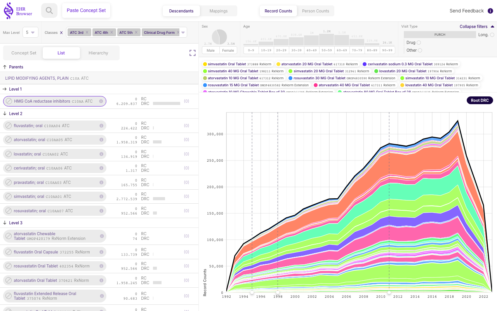
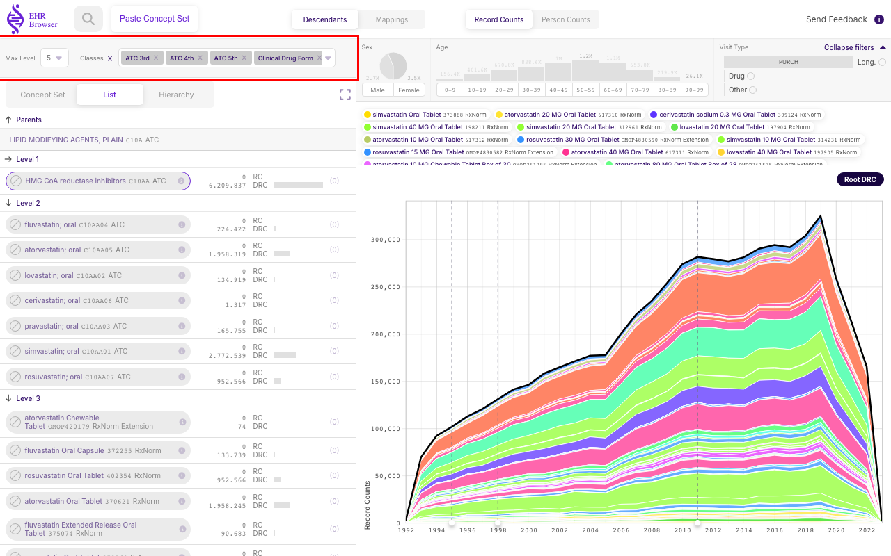
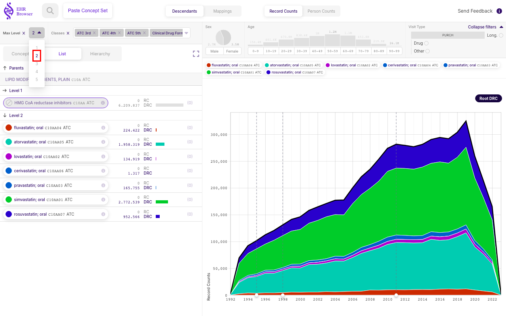
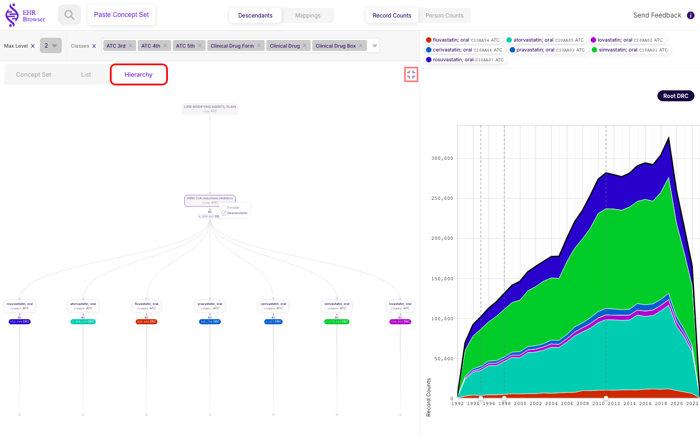
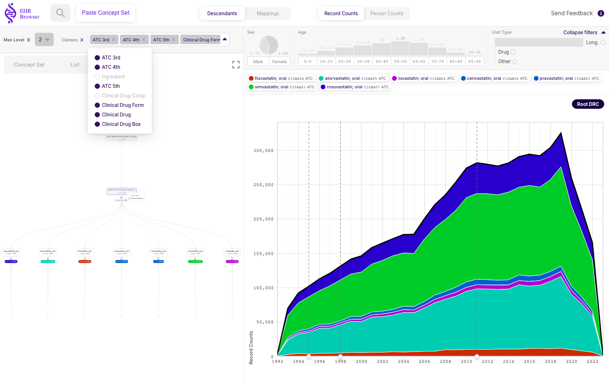
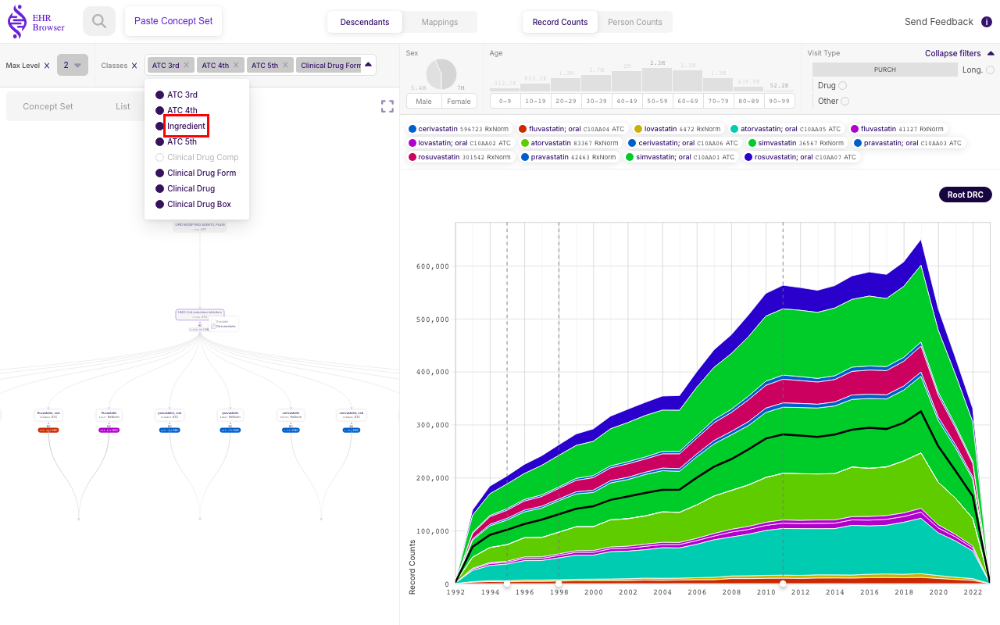

# Exploring a large tree, ATC tree example

Sometimes a selected **Concept** has a very large number of descendants spread across many levels. This is especially the case when exploring the **ATC** (Anatomical Therapeutic Chemical) tree. The **OMOP-CDM** vocabularies use **ATC** as a classification vocabulary, meaning that **ATC** concepts group the more detailed **RxNorm** and **RxNorm Extension** drug vocabularies. As a result, a level-4 **ATC** code has its level-5 **ATC** codes as descendants, but also every **RxNorm** code beneath each of those level-5 codes, each with its own sub-tree.

Cases like this produce trees, lists and time plots with hundreds of codes that are hard to interpret. To handle this, **EHRBrowser** provides filters that prune the tree and simplify the visualisation. This chapter uses the level-4 **ATC** code **C10AA** *'HMG CoA reductase inhibitors'* (the statins) as an example.

## Loading ATC code C10AA 'HMG CoA reductase inhibitors'

Loading **C10AA** and switching to the **Hierarchy** tab shows the problem immediately. The **Concept** has so many descendants that the tree cannot fit the display — the nodes collapse into a barely visible band across the panel. The time plot on the right is equally overwhelmed: dozens of drug concepts stack up in a dense band of colours, and the legend runs to many rows, so it is hard to distinguish anything.

The **List** view is a little easier to follow, because the direct level-5 **ATC** children are shown at the top grouped by level. Even so, the underlying **RxNorm** tree extends five more levels down and includes well over a hundred nodes, so the list quickly becomes long.

Two tools at the top of the panel — **Max Level** and **Classes** (highlighted above) — help to prune the tree:

- **Max Level** cuts the tree at a maximum depth.
- **Classes** removes nodes by their concept class.

The next two sections show each in turn.

### Using 'Max Level' pruning tool

Opening the **Max Level** dropdown and choosing level **2** cuts the tree so that only the immediate level-5 **ATC** children remain — the seven statin groups (simvastatin, atorvastatin, rosuvastatin, fluvastatin, pravastatin, lovastatin and cerivastatin). The time plot now shows the **DRC** (Descendant Record Counts) of just these seven groups, so it reduces to seven clean areas. Drug utilisation over time for each group is now far easier to interpret.

Switching back to the **Hierarchy** tab and clicking the expand/compress icon (both highlighted above) enlarges the now-pruned tree so that it fits the window: the root, the **C10AA** **Concept** and its seven level-5 **ATC** children are all clearly laid out, each with its **DRC** (Descendant Record Counts).

### Using 'Classes' pruning tool

The **Classes** dropdown lists every concept class present in the tree. In the **OMOP-CDM** vocabulary there are several ways to group the highly granular drug concepts. For example, the **Ingredient** class groups drugs by their active ingredient, much as the level-5 **ATC** codes do. By default **EHRBrowser** keeps the **Ingredient** and **Clinical Drug Comp** classes deactivated (shown greyed-out above).

Activating **Ingredient** so that both **Ingredient** and **ATC 5th** are selected adds both groupings to the tree. The second level now contains both the **RxNorm** **Ingredient** nodes and the level-5 **ATC** nodes, and each pair points down to the *same* children. Because those children are counted under both parents, the stacked areas in the time plot overflow the black **Root DRC** (Root Descendant Record Counts) line. This overflow is a signal that the hierarchy is really a graph, where children are shared between parents. It is precisely to avoid this double counting that **Ingredient** and **Clinical Drug Comp** are kept deactivated by default.
