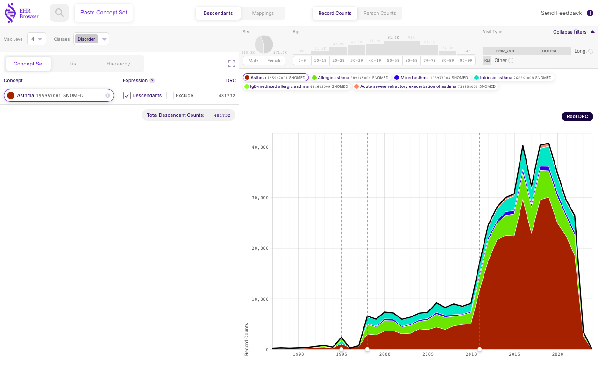
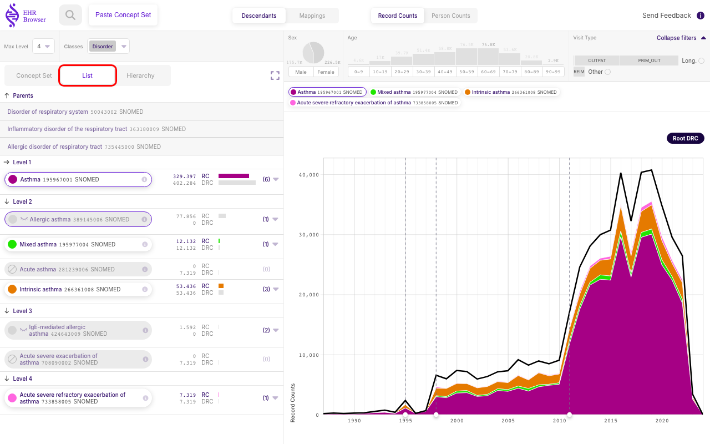
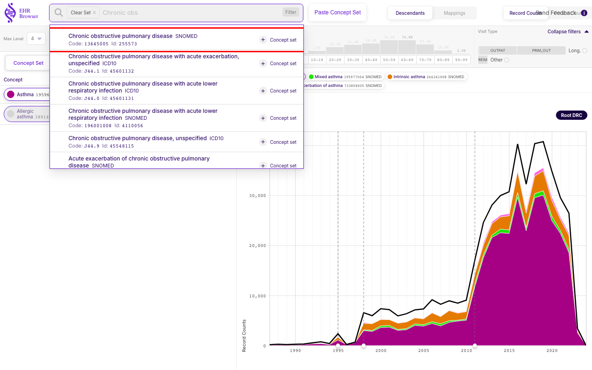
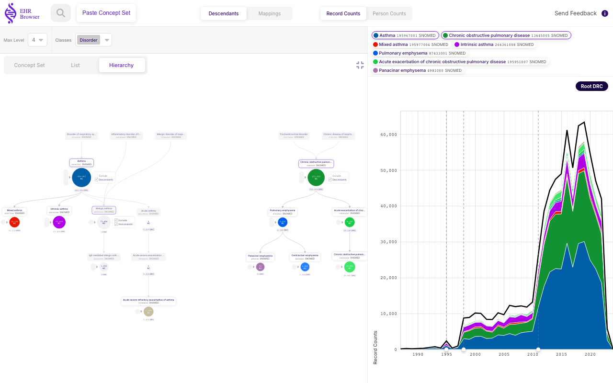
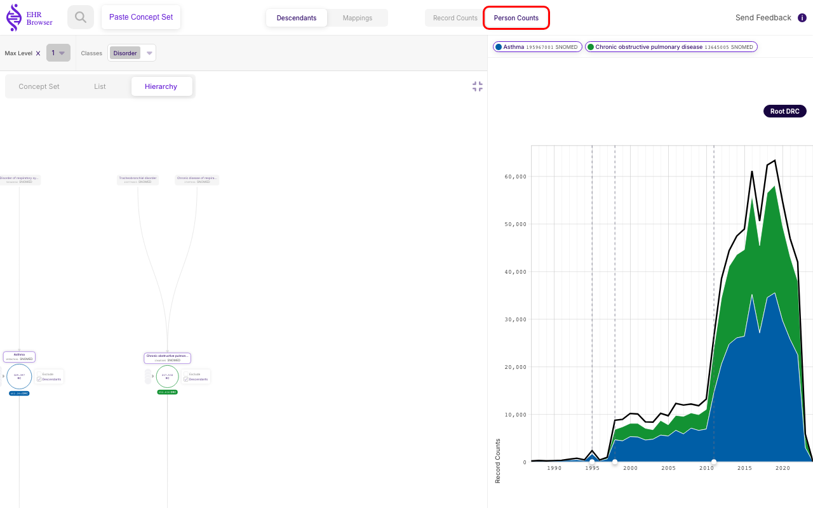

# Working with Concept Sets

Beyond looking at a single **Concept**, **EHRBrowser** lets you build and explore a **Concept Set**. A **Concept Set** is a mechanism for describing a group of **Concepts** without having to list every individual code: instead of enumerating codes one by one, it leans on the vocabulary hierarchy to *include* whole branches of the tree and to *exclude* specific sub-branches you do not want. You can read more about **Concept Sets** in the [Book of OHDSI](https://ohdsi.github.io/TheBookOfOhdsi/Cohorts.html#conceptSets).

This chapter builds a worked example: a combined asthma **Concept Set** that keeps **Asthma** and its descendants but removes allergic asthma, and then adds **Chronic obstructive pulmonary disease** (**COPD**) alongside it. Along the way it shows how including, excluding, and pruning change both the counts and the way the set is drawn.

## Starting from a single Concept

We start from the **Asthma** (**SNOMED**) **Concept** introduced in the first chapter, opened directly at its concept page. **EHRBrowser** does not treat this as a bare single code: it loads it as a one-item **Concept Set**, shown in the **Concept Set** panel on the left.

Notice the **Descendants** box next to the **Asthma** row is ticked. Unlike in ATLAS — where a newly added **Concept** covers only itself — a **Concept** added here is included *with all of its descendants* by default. That is why the single row already reports a **DRC** (Descendant Record Counts) of **481,732**, matching the **Total Descendant Counts** for the whole set: the set currently means "**Asthma** and everything beneath it in the hierarchy". The stacked time plot on the right shows the same thing, broken down by the coloured descendant **Concepts** in the legend.

## Adding a Concept to the set

New **Concepts** are added by searching *behind* the **Clear Set** box. Open the search, and type — here `Aller` — into the field that appears to the right of the **Clear Set** button. A drop-down of matching **Concepts** appears; each row carries its name, vocabulary, code and identifier, and a **Concept set** button to add it.

The highlighted suggestion is the **SNOMED** **Allergic asthma** **Concept** (code 389145006, id 4191479). Take care with the **Clear Set** box itself: clicking it empties the whole set, so it is deliberately separated from the search that adds to the set.

**Allergic asthma** has now been added as a second row. Because it is *already a descendant* of **Asthma**, it was counted in the set before we added it explicitly — so the **Total Descendant Counts** does not change and stays at **481,732**. Adding it on its own line simply gives us a handle to act on that branch directly.

## Excluding a Concept

That handle lets us remove a branch. Ticking the **Exclude** box on the **Allergic asthma** row excludes that **Concept** *and all of its descendants* from the set.

The effect is immediate: the **Allergic asthma** row now reports a **DRC** (Descendant Record Counts) of **0**, and the **Total Descendant Counts** for the set drops by exactly that branch's contribution, from 481,732 to **402,284**. In the time plot the allergic-asthma layer has disappeared from the stack and from the legend — the set now means "**Asthma** and its descendants, *but not* allergic asthma or anything under it".

## Seeing the exclusion in the Hierarchy and List views

The same set can be viewed as a tree or as a list, and both make the exclusion visible.

In the **Hierarchy** view, **Allergic asthma** and its child **IgE-mediated allergic asthma** are greyed out: they are drawn in place so you can see where they sit in the tree, but faded to signal that they are no longer part of the **Concept Set**. The excluded node's **RC** (Record Counts) bubble still shows, while its **DRC** (Descendant Record Counts) reads 0.

The **List** view — the same descendants compacted into a per-level list — shows the exclusion the same way: the **Allergic asthma** row, and the descendants that fall under it, are greyed with a **DRC** (Descendant Record Counts) of 0, while the rest of the set keeps its counts.

## Adding a third Concept

A **Concept Set** is not limited to one hierarchy. Back in the **Concept Set** view, searching again — this time for `Chronic obs` — lets us add a **Concept** from a completely separate part of the vocabulary.

The highlighted suggestion is the **SNOMED** **Chronic obstructive pulmonary disease** **Concept** (id 255573). Because it is not a descendant of **Asthma**, adding it introduces a second, independent tree into the set.

Switching to the **Hierarchy** view and enlarging it with the expand icon (top right of the panel) shows both hierarchies side by side: the **Asthma** tree on the left and the new **Chronic obstructive pulmonary disease** tree on the right. The set now describes both conditions at once, each contributing its own descendants.

## Simplifying the view with the Max Level pruning tool

With two full trees on screen the plot becomes busy. The same pruning tools shown in the ATC chapter apply here. Setting **Max Level** to `1` collapses each tree to just its main **Concept**, so only the top-level descendant counts remain.

Now the tree shows only the two roots — **Asthma** and **Chronic obstructive pulmonary disease** — and the time plot reduces to two clean areas. This makes it easy to compare the two conditions' descendant counts hand in hand over time.

## Switching to Person Counts

Finally, the whole view can be switched from **Record Counts** to **Person Counts** from the top bar.

With **Person Counts** selected, the plot rescales to the *number of distinct persons* receiving each diagnosis over time, rather than the number of records. The two conditions of the **Concept Set** — **Asthma** and **Chronic obstructive pulmonary disease** — are now compared by how many people they reach each year.
