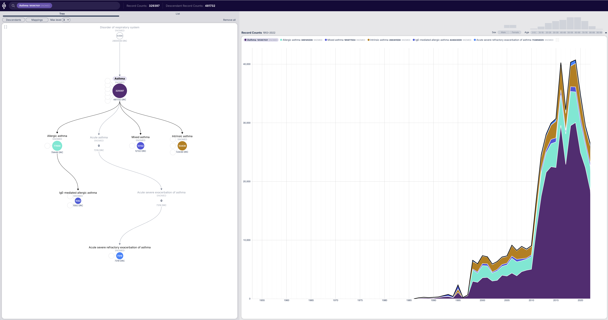

# EHR Browser

EHR Browser is a web tool that connects to a OMOP-CDM instance and allows to browse the vocabulary graph and visualize how a concept is constructed and used over time. 

Given a concept, the EHR Browser will show the descendant graph of the concept and, optionally, the nodes' mapped concepts. 
The record counts over time for each concept in the graph are also shown.
This allows to explore how each descendant or mapped concept contributes to the concept's record counts over time.
In addition, for complex graphs, the EHR Browser allows to prune the graph by level or concept class.
Clicking any concept in view will open that concept to be explored. 

Use cases:
- What are the descendants of a concept in the database?
- How each descendant contributes to the record counts of a concept, over time, gender and age?
- What non-standard concepts map to a standard concept and its descendants?
- How each source concept contributes to the record counts of a concept, over time, gender and age?

# Demo

A live demo is available at:
https://ehr-browser.onrender.com/

This contains a limited set of concepts that work.

| Concept ID | Vocabulary | Description |
|------------|-------------|-------------|
| 317009     | Snomed | Asthma |
| 45596282   | ICD10 | Asthma |
| 21601855   | ATC level 4 | C10AA (Statins) |
| 320136     | SNOMED | Disorder of respiratory system |

# Deployment

 see dev/README.md for instructions on how to deploy the EHR Browser in a local OMOP-CDM instance.

# Development

see dev/README.md for instructions on how to develop the EHR Browser.

